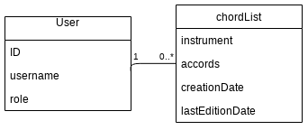

# Chords Server

Serveur pour Chords-Vanilla permettant de lier des suites d'accords à un utilisateur.

Serveur développé avec Koa, api exposée en GraphQL, base de données Postgres.

## Fonctionnalités

### Fonctionnalités de base

- Authentification (avec Passport)
- Autorisation
- Récupérer toutes les suites d'accords
- Récupérer une suite d'accords
- Ajouter une suite d'accords
- Supprimer une suite d'accords
- Modifier une suite d'accords

### Idées futures

- Liste d'accords publique ou privée
- Partage de liste d'accords
- Mettre du texte dans la liste d'accords
  - Ajouter un champs texte dans `chordList`
  - Faire référence aux accords dans le champs texte (${0} pour le premier accord par exemple)
  - Exemple : `Peut se jouer avec ${0} ${1} \n Ou ${2} ${3}`

## Schema de bdd V1

- role : `user` | `admin`

- instrument : `ukulele` | `guitar` | `piano`
- accords : nom d'accords séparé par des virgules
